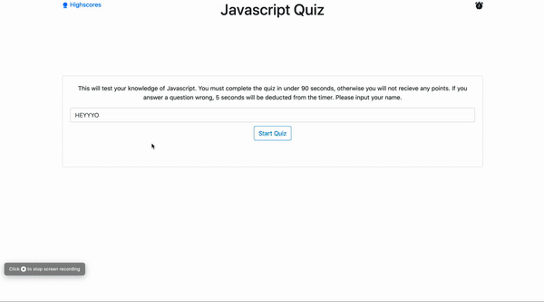

# Javascript Quiz
This application tests the users skills in Javascript by asking them 5 questions

1. Starts a timer when the quiz is started
2. Updates the timer as the user gets questions wrong or right, and awards them time accordingly
3. When the user is finished with the quiz it updates the localstorage of their high scores

